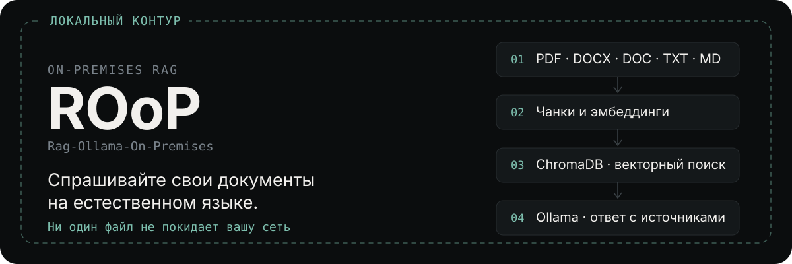
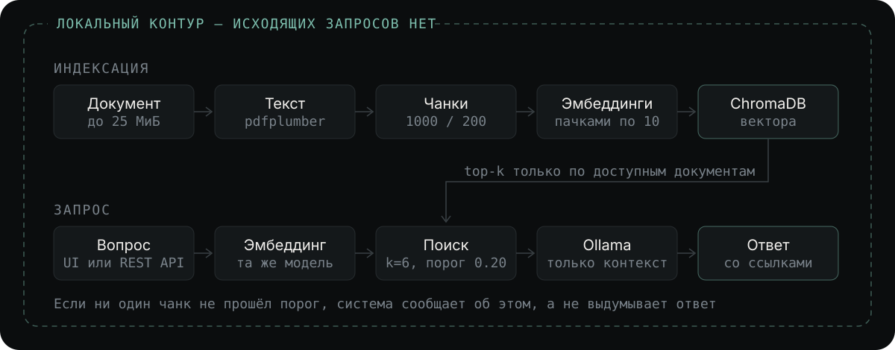

<p align="center">
  
</p>

<p align="center">
  <a href="https://github.com/Fgeeha/ROoP/actions/workflows/ci.yml"></a>
  <a href="https://github.com/Fgeeha/ROoP/actions/workflows/cd.yml"></a>
</p>

---

## Что это

Вы загружаете рабочие документы — договоры, регламенты, техническую документацию — и задаёте по ним вопросы обычным языком. Система находит подходящие фрагменты и формулирует ответ, показывая, из какого файла взят каждый источник.

Всё выполняется на вашем железе. Ни документы, ни вопросы, ни эмбеддинги не уходят во внешние сервисы: языковая модель, векторная база и веб-интерфейс работают в одном `docker compose`. Внешних AI API в проекте нет и добавлять их не предполагается.

Это подходит там, где документы нельзя отправить в облако: закрытый контур, персональные данные, коммерческая тайна, требования регулятора.

## Как работает

<p align="center">
  
</p>

Две вещи, которые отличают это от обёртки над чат-ботом:

**Поиск ограничен правами на уровне базы, а не интерфейса.** Фильтр по владельцу применяется в самом запросе к ChromaDB, поэтому чужой документ не может попасть в контекст модели даже случайно.

**Модель не додумывает.** Фрагменты ниже порога релевантности отбрасываются до сборки промпта. Если после фильтрации не осталось ничего, система прямо сообщает, что информации нет, вместо правдоподобного вымысла.

## Быстрый старт

Нужны Docker и Docker Compose.

```bash
git clone https://github.com/Fgeeha/ROoP.git
cd ROoP/rag_ollama

cp .env.example .env
# задайте DJANGO_SUPERUSER_PASSWORD, SECRET_KEY и POSTGRES_PASSWORD

make up-image-cpu  # ноутбук или сервер без GPU
# make up-image    # NVIDIA GPU
```

`up-image` запускает готовый образ из реестра. Чтобы собрать локально, используйте `make up-cpu` / `make up`.

Первый запуск занимает несколько минут — скачиваются модели Ollama: gemma3:4b (~3,3 ГБ) и bge-m3 (~1,2 ГБ). Подобрать модели под своё железо: `make models-recommend`.

Дальше откройте **http://localhost:8000**, загрузите PDF и задайте по нему вопрос.

Удалённая Ollama, Open WebUI и запуск без Docker описаны в [`rag_ollama/README.md`](rag_ollama/README.md).

## Возможности

- **Форматы** — PDF, DOCX, DOC, TXT, Markdown.
- **Интерфейс** — Django и HTMX, живой прогресс индексации «N / M чанков».
- **REST API** — загрузка, чат, список и удаление документов, переиндексация, статистика.
- **Многопользовательность** — регистрация с подтверждением почты, изоляция документов и чатов.
- **Общий доступ** — публичные ссылки на чат или документ со сроком действия и возможностью отзыва.
- **Восстановление** — прерванная индексация переводится в ошибку при старте, документ переиндексируется кнопкой без повторной загрузки файла.
- **Режимы запуска** — локальная Ollama на GPU, на CPU, либо удалённая Ollama или Open WebUI.

Система рассчитана на работу при 16 ГБ RAM: индексация сериализована в один поток, размер загружаемого файла ограничен, эмбеддинги считаются пачками, Ollama ограничена одной моделью в памяти.

## Готовые образы

Каждая успешная сборка `Master` публикуется в два реестра с одинаковым содержимым:

```bash
docker pull fgeeha/roop:latest          # Docker Hub
docker pull ghcr.io/fgeeha/roop:latest  # GitHub Packages
```

| Тег | Что это |
|---|---|
| `latest` | Последняя успешная сборка `Master` |
| `<short-sha>` | Конкретный коммит, например `eefcb16` |
| `1.2.0`, `1.2` | Версия из git-тега `v1.2.0` |

В production закрепляйтесь на теге версии или на sha, а не на `latest`. Какой образ запускает `make up-image`, задаётся переменной `ROOP_IMAGE` в `.env`.

Релиз выпускается отправкой тега:

```bash
git tag v1.2.0
git push origin v1.2.0
```

Тег запускает сборку образов, сканирование Trivy и создание [GitHub Release](https://github.com/Fgeeha/ROoP/releases) со списком изменений и командами `docker pull`. Тег с суффиксом (`v1.2.0-rc1`) выходит как pre-release.

## Конфигурация

Всё задаётся в `rag_ollama/.env`. Обязательных полей три — остальное можно не трогать.

| Переменная | Обязательно | Дефолт | Когда менять |
|---|---|---|---|
| `DJANGO_SUPERUSER_PASSWORD` | **Да** | — | Задать перед первым запуском. Генерация: `python3 -c "import secrets; print(secrets.token_urlsafe(24))"` |
| `SECRET_KEY` | **Да** | `django-insecure-...` | Заменить на случайную строку длиной 50+ символов |
| `POSTGRES_PASSWORD` | **Да** | `change-me-in-production` | Задать надёжный пароль |
| `LLM_MODEL` | Нет | `gemma3:4b` | Чат-модель. Подобрать под железо: `make models-recommend` |
| `EMBED_MODEL` | Нет | `bge-m3` | Мультиязычная embedding-модель. **Смена требует полной переиндексации**: размерность векторов другая |
| `ROOP_IMAGE` | Нет | `fgeeha/roop:latest` | Какой образ запускает `make up-image`. В production — тег версии или sha |
| `OLLAMA_SSL_CERT_FILE` | Нет | пусто | Путь внутри контейнера к CA-bundle. Нужен, если корпоративный прокси подменяет TLS и `ollama pull` падает с `x509` |
| `OLLAMA_REQUEST_TIMEOUT` | Нет | `300` | Поднять (напр. `600`), если индексация большого файла падает по таймауту на слабой CPU-машине |
| `EMBED_BATCH_SIZE` | Нет | `10` | Снизить (напр. `5`) при нехватке памяти во время индексации |
| `MAX_UPLOAD_SIZE` | Нет | `26214400` (25 МиБ) | Жёсткий лимит на документ в байтах. Файл больше отклоняется до индексации: API отдаёт `413` |
| `GUNICORN_WORKERS` | Нет | `1` | **Не повышать.** ChromaDB встроена в процесс Django: несколько процессов повредят индекс. Масштабирование — через `GUNICORN_THREADS` |
| `GUNICORN_THREADS` | Нет | `4` | Поднять, если UI подтормаживает при нескольких одновременных пользователях |
| `OLLAMA_MAX_LOADED_MODELS` | Нет | `1` | Только локальная Ollama. При `1` чат- и embedding-модель не занимают RAM одновременно |
| `OLLAMA_NUM_PARALLEL` | Нет | `1` | Только локальная Ollama. Каждый параллельный запрос умножает KV-кэш — главный путь к OOM на 16 ГБ |
| `OLLAMA_KEEP_ALIVE` | Нет | `5m` | Как долго модель остаётся в памяти после последнего запроса |
| `OLLAMA_CONTEXT_LENGTH` | Нет | `4096` | Больше окно — больше KV-кэш и расход памяти |
| `SEARCH_K` | Нет | `6` | Поднять, если ответы неполные; снизить, если медленно. Выше `MAX_CONTEXT_CHARS` не даст эффекта — лишние чанки отсекутся |
| `MAX_CONTEXT_CHARS` | Нет | `0` (авто) | Бюджет контекста в промпте. `0` — считается из `OLLAMA_CONTEXT_LENGTH` (при 4096 это 7040 символов). Задавать вручную нужно редко |
| `SEARCH_RELEVANCE_THRESHOLD` | Нет | `0.20` | Поднять (напр. `0.35`), если в ответы попадает нерелевантный контекст; подбирается под свой корпус |
| `API_KEY` | Нет | `your-secret-api-key-change-me` | Задать при использовании REST API |
| `SHARE_LINK_TTL_DAYS` | Нет | `30` | Срок жизни публичной ссылки в днях; `0` — бессрочно |

Полный список — в [`rag_ollama/.env.example`](rag_ollama/.env.example).

## Troubleshooting

**Документ завис в статусе «Индексируется» или показывает «Ошибка».** Индексация прервалась: сервер перезапустили или закончилась память. При следующем старте зависшие документы автоматически переводятся в состояние ошибки. Нажмите «↻» в списке — файл уже на сервере, загружать заново не нужно.

**Документ долго ждёт в статусе «Ожидает обработки».** Это нормально: одновременно индексируется ровно один документ, остальные стоят в очереди. Так система не держит в памяти несколько документов сразу.

**«Файл слишком большой».** Размер превышает `MAX_UPLOAD_SIZE` (по умолчанию 25 МиБ). Разбейте документ или поднимите лимит, помня, что в пике индексация занимает в несколько раз больше памяти, чем сам файл.

**«Очередь индексации переполнена».** В очереди уже 100 документов. Файл сохранён, но не проиндексирован: дождитесь завершения текущих задач и нажмите «↻».

**Подняли `SEARCH_K`, а ответы не стали полнее.** Контекст ограничен `MAX_CONTEXT_CHARS`, и лишние чанки отсекаются, начиная с наименее релевантных. Поднимайте вместе с `SEARCH_K` и `OLLAMA_CONTEXT_LENGTH`, помня, что большее окно означает больший расход памяти. В логах видно строку `Context budget ... kept N/M chunks`, в API-ответе — поле `context_truncated`.

**`ollama pull` падает с `x509: certificate signed by unknown authority`.** Корпоративный шлюз расшифровывает TLS и подписывает соединения своим корневым сертификатом. В браузере всё работает, потому что этот сертификат установлен в системе — внутри контейнера Ollama его нет. Соберите общий набор сертификатов и укажите путь внутри контейнера:

```bash
make ollama-ca CA=/path/to/corporate-root.crt   # склеит системный bundle с корпоративным
# в .env:  OLLAMA_SSL_CERT_FILE=/certs/ca-bundle.crt
make down && make up-cpu && make models
```

Если прокси не подменяет TLS, а просто проксирует, сертификат не нужен — задайте `HTTPS_PROXY` и `NO_PROXY` в `.env`. Подробности — в [`rag_ollama/README.md`](rag_ollama/README.md).

**Реестр моделей закрыт полностью или сети нет вообще.** Модели и образы переносятся файлами: pull на хосте, донорская машина, выборочный перенос, `docker save`, импорт из GGUF — [`doc/offline-models.md`](doc/offline-models.md).

**Нужно перестроить индекс после смены `EMBED_MODEL`.** Смена embedding-модели меняет размерность векторов, поэтому нужна новая коллекция: задайте другое `CHROMA_COLLECTION`, перезапустите, затем переиндексируйте. Кнопка «↻» работает и для успешно обработанных документов. Для массовой переиндексации остановите веб-сервис: `make down && docker compose run --rm django python manage.py reindex_documents --status completed`.

**Публичная ссылка перестала открываться.** По умолчанию ссылка живёт 30 дней (`SHARE_LINK_TTL_DAYS`). Создайте её заново кнопкой «Поделиться». Активные ссылки и их сроки видны в профиле, там же их можно отозвать досрочно.

**Остальное** — раздел Troubleshooting в [`rag_ollama/README.md`](rag_ollama/README.md).
